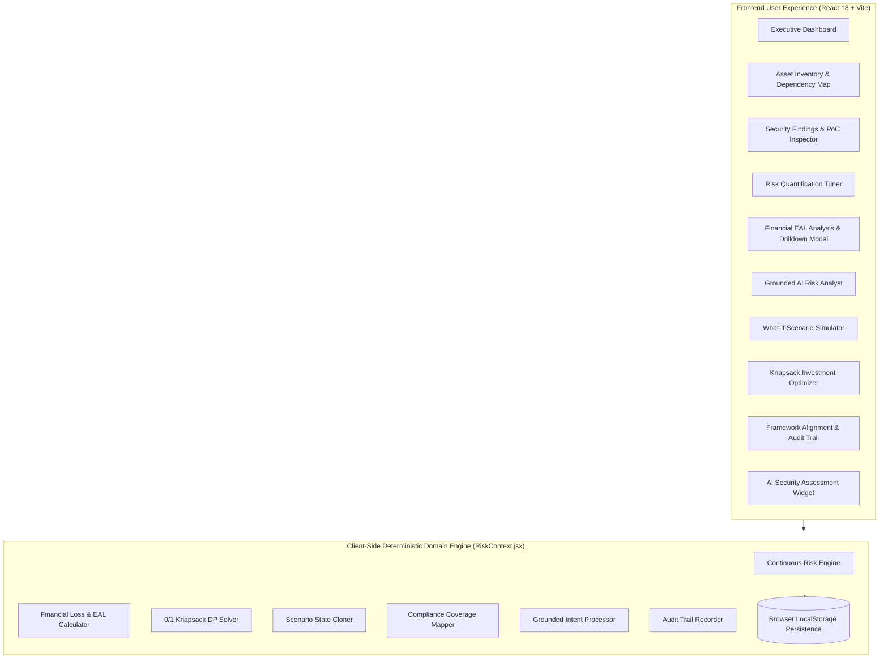

# CyberRiskIQ

**AI-Powered Cyber Risk Quantification & Investment Optimization Platform**

CyberRiskIQ continuously recalculates and transforms cybersecurity telemetry and security findings into quantified financial risk (Expected Annual Loss in ₹), explains major risk drivers, simulates mitigation strategies, and optimizes cybersecurity investments under explicit budget constraints.

---

## 🎯 Executive Summary & Core Philosophy

Traditional cybersecurity programs communicate risk using qualitative labels (*Low*, *Medium*, *High*) or technical vulnerability metrics (*CVSS*). While useful for technical remediation, these metrics fail to answer fundamental board and executive questions:
- *How much financial cyber risk does the enterprise carry right now?*
- *Which assets and business units contribute the largest annualized liability?*
- *Which vulnerabilities contribute most to Expected Annual Loss (EAL)?*
- *What is the quantifiable financial penalty if remediation is delayed by 30 days?*
- *How should a finite cybersecurity budget be allocated to yield maximal risk reduction (ROSI)?*

CyberRiskIQ bridges this communication and decision-making gap through a **transparent, deterministic, and traceable cyber-risk intelligence chain**:


CyberRiskIQ is **not merely** a vulnerability scanner, a standalone penetration tester, an isolated compliance scorecard, or an LLM chatbot. It is an **integrated cyber-risk decision intelligence platform** that connects technical security telemetry to business impact, financial liabilities, and portfolio optimization.

---

## 🚀 Core Capabilities & Modules

### 1. AI Security Assessment Engine
An integrated security assessment module that performs reconnaissance, attack-surface discovery, vulnerability probing, and exploit validation against authorized targets.

- **Dual-Mode Execution**:
  - **Demonstration / Synthetic Mode**: High-fidelity, deterministic vulnerability and PoC trace generator for rapid offline demonstration and risk modeling.
  - **Live Assessment Mode**: Modular execution adapter for security probing against authorized URLs, APIs, or repositories with mandatory authorization confirmation modal.
- **Workflow**:
  $$\text{Target} \longrightarrow \text{Reconnaissance} \longrightarrow \text{Surface Discovery} \longrightarrow \text{Vulnerability Testing} \longrightarrow \text{Exploit Validation} \longrightarrow \text{PoC Evidence} \longrightarrow \text{Normalized Finding}$$
- **Coverage**: Web applications, REST APIs, authorization flows (e.g., BOLA, IDOR), outdated packages, exposed credentials, and critical service ports.

> **Responsible Use Warning**: All security assessment activities must be conducted solely against systems, APIs, or repositories where explicit, written authorization has been granted.

---

### 2. Deterministic Continuous Risk Quantification
CyberRiskIQ normalizes multidimensional risk parameters into a transparent, bounded **0–100 Asset Risk Rating**:

- **Correlated Risk Indicator (0.0–10.0)**:
  $$\text{Correlated Indicator} = \text{CVSS Base} + 1.2 \times [\text{Exploit Available}] + 1.5 \times [\text{Internet Exposed}]$$
- **Asset Risk Rating Formula**:
  $$\text{Risk Score} = \Big( 0.5 \times \text{Threat Likelihood} + 0.3 \times \text{Asset Criticality} + 0.2 \times \text{Control Gap} \Big) \times 100 \times \text{Appetite Multiplier}$$
  - *Threat Likelihood*: Weighted blend of maximum and average correlated vulnerability indicators across open findings.
  - *Asset Criticality*: Weighted tier (Critical = 1.0, High = 0.8, Medium = 0.6, Low = 0.4).
  - *Control Gap*: $(1.0 - \text{Average Effectiveness of Controls})$.
  - *Risk Appetite Multiplier*: Low = 1.25, Medium = 1.0, High = 0.75.

---

### 3. Financial Cyber Risk Modeling & Explainability
CyberRiskIQ translates technical risk scores into itemized financial liabilities expressed in Indian Rupees (₹) and Expected Annual Loss (EAL):

#### A. Potential Loss per Incident
$$\text{Potential Loss} = \text{Downtime Loss} + \text{Data Breach Cost} + \text{Regulatory Penalties} + \text{Recovery / Forensics} + \text{Reputation Impact}$$
- **Downtime Loss**: $\text{Hourly Cost} \times \text{Revenue Scaler} \times 4\text{ hours outage}$
- **Data Breach Cost**: $\text{Records Exposed} \times \text{Employee Scaler} \times \text{Cost per Record}$
- **Regulatory Liability**: Statutory penalties scaled to organizational revenue (RBI, SEBI, DPDP Act)
- **Incident Recovery**: Forensic investigation, crisis containment, and technical restoration costs
- **Reputation Factor**: Customer churn and market impact

#### B. Configurable Incident Probability Calibration Model
Linear probability scaling mapped deterministically from asset risk score:
$$\text{Probability } P = 0.01 + (\text{Risk Score} - 10) \times \left( \frac{0.35 - 0.01}{100 - 10} \right) = 0.01 + (\text{Risk Score} - 10) \times \frac{0.34}{90}$$
*(Score 10 corresponds to 1.0% annual probability; Score 100 corresponds to 35.0% annual probability).*

> **Model Assumption**: This linear probability calibration ($10 \rightarrow 1\%, 100 \rightarrow 35\%$) is a transparent, configurable decision-modeling assumption for the MVP rather than an actuarial statistical claim.

#### C. Expected Annual Loss (EAL)
$$\text{EAL} = \text{Annual Incident Probability } (P) \times \text{Potential Loss } (L)$$

*Illustrative Example:*
- High-Criticality Payment API (Risk Score = 90) $\rightarrow$ Annual Probability = 31.2%
- Single-Incident Potential Loss = ₹4.33 Crore
- **Asset Expected Annual Loss (EAL) = ₹1.35 Crore / year**

---

### 4. Interactive Financial Explainability & Traceability
Every metric across dashboards and financial ledgers is fully transparent. Clicking any asset or KPI opens the **Explainability Modal** displaying:
1. Deterministic mathematical formula ($P \times L = \text{EAL}$)
2. Itemized loss breakdown across all 5 cost categories
3. Primary contributing risk drivers (exposure, sensitivity, open findings)
4. Connected end-to-end traceability chain:
   $$\text{EAL (₹)} \longrightarrow \text{Business Unit} \longrightarrow \text{Business Service} \longrightarrow \text{Asset} \longrightarrow \text{Finding / PoC} \longrightarrow \text{Controls} \longrightarrow \text{Knapsack Remediation}$$

---

### 5. Grounded AI Cyber Risk Analyst
A conversational risk copilot grounded strictly in the active in-memory and browser-persisted `RiskContext` data (current calculated risk ratings, EAL, business units, assets, and findings).

- **Zero Hallucination**: Financial numbers, probability rates, EAL deltas, and budget recommendations are computed directly by deterministic application logic rather than invented by the language model.
- **Supported Query Intents**:
  - *Highest Financial Cyber Risk*: Identifies top vulnerable assets, primary risk drivers, and annualized loss.
  - *Business Unit Exposure*: Evaluates and ranks enterprise divisions by aggregated EAL.
  - *Budget Prioritization & ROSI*: Summarizes knapsack portfolio selections and return percentages.
  - *Security Assessment Telemetry*: Inspects validated findings and confirmed exploit traces.

---

### 6. What-if Scenario Simulator
Allows risk officers and security architects to model environmental transformations and defensive investments against cloned state:

- **Hypothetical Overlays**: Enforce org-wide MFA/PAM (95%), Deploy Next-Gen EDR (95%), Continuous Automated Patching, Network Micro-segmentation, 24/7 SOC/SIEM Monitoring, and Encrypted Immutable Backups (70% recovery cost reduction).
- **Adversarial / Operational Delay**: Simulate a **+30 Days Remediation Delay**, applying an exposure decay penalty (+15% EAL liability).
- **Dynamic Delta**: Generates side-by-side comparisons showing baseline vs. simulated EAL, total exposure, enterprise risk score, and annual cost savings.

---

### 7. Security Investment Optimizer (0/1 Knapsack Solver)
Solves a classic constrained optimization problem: given a finite cybersecurity budget (e.g., ₹35 Lakh), select the subset of defensive controls that yields the maximum reduction in Expected Annual Loss without exceeding available capital.

$$\max \sum_{i=1}^n x_i \cdot \Delta \text{EAL}_i \quad \text{subject to} \quad \sum_{i=1}^n x_i \cdot \text{Cost}_i \le \text{Budget}, \quad x_i \in \{0, 1\}$$

- **Constraint Overrides**:
  - **Force-In (Lock-In)**: Mandatory baseline controls (e.g., regulatory compliance requirement).
  - **Force-Out (Lock-Out)**: Infeasible or prohibited security initiatives.
- **Return on Security Investment (ROSI)**:
  $$\text{ROSI} = \left[ \frac{\text{Total EAL Reduction} - \text{Total Implementation Cost}}{\text{Total Implementation Cost}} \right] \times 100$$
- **Knapsack Spend Frontier Curve**: Dynamic chart plotting residual EAL against increasing budget increments, clearly highlighting the **Optimal Spend Zone** and diminishing returns.

> **Optimizer Assumption**: The MVP computes individual control benefits additively against baseline state. Modeling higher-order nonlinear control interaction effects is documented under future scope.

---

### 8. Framework Alignment & Platform Audit Trail
- **Multi-Framework Alignment & Control Coverage**: Evaluates active security controls against specific regulatory clauses:
  - **NIST Cybersecurity Framework (CSF 2.0)**: Identify, Protect, Detect, Respond, Recover.
  - **ISO/IEC 27001 (Annex A)**: A.9 Access, A.12 Ops, A.14 Dev, A.17 Continuity, A.18 Compliance.
  - **RBI Cyber Security Framework (CSF)**: Baseline controls for Indian commercial banking.
  - **SEBI CSCRF**: Cyber security and resilience framework for securities markets.
  - **CIS Critical Security Controls (v8)**: Asset inventory, data protection, access management, vulnerability response.
- **Platform Audit Trail**: Immutable log tracking user interventions, control adjustments, data ingestions, and what-if simulation triggers. Persisted locally in browser storage (`localStorage`).
- **Multi-Tier Reporting**: Exports one-click Executive Briefings, Technical Analysis reports, and Compliance Audit packs via PDF.

---

## 🏛️ System Architecture



---

## 💻 Technology Stack & Implementation Status

| Component | Technology | Implementation Status | Purpose |
|---|---|---|---|
| **Frontend Framework** | React 18, Tailwind CSS | **Implemented** | Modular single-page application |
| **Bundler & Tooling** | Vite 8 | **Implemented** | Fast development server & production bundler |
| **Data Visualization** | Apache ECharts (`echarts-for-react`) | **Implemented** | Dynamic EAL curves, spend frontiers, BU distribution charts |
| **State & Calculation Engine** | `RiskContext.jsx` + LocalStorage | **Implemented** | Reactive client-side deterministic risk & financial engine |
| **Icons & Design Tokens** | Lucide React | **Implemented** | Enterprise iconography |
| **Document Generation** | jsPDF + Print API | **Implemented** | Client-side export of executive and technical reports |
| **Testing Suite** | Node.js Test Suite (`tests/test_engines.js`) | **Implemented** | Automated unit tests for risk, EAL, knapsack, & compliance |

---

## 📁 Repository Structure

```
CyberRiskIQ/
├── src/
│   ├── components/
│   │   ├── Dashboard.jsx         # Executive KPIs, EAL vs Spend curve, Top Risks
│   │   ├── FinancialAnalysis.jsx # BU & Category EAL breakdowns, interactive ledger
│   │   ├── FinancialDrilldownModal.jsx # Explainability breakdown & traceability chain
│   │   ├── InvestmentOptimizer.jsx # 0/1 Knapsack solver, Lock-In/Out, ROSI curve
│   │   ├── ScenarioSimulator.jsx # Cloned state what-if simulator & delay penalties
│   │   ├── ComplianceReports.jsx # Multi-framework alignment, audit log, PDF exports
│   │   ├── AssetInventory.jsx    # 52 asset register, BU filters, SVG dependency map
│   │   ├── RiskQuantification.jsx# Asset risk ratings & interactive control sliders
│   │   ├── Findings.jsx          # Normalized findings table, file ingestion, PoC inspector
│   │   ├── SecurityAssessmentControl.jsx # AI Security Assessment widget & terminal
│   │   ├── AnalystChat.jsx       # Grounded AI Risk Analyst conversational interface
│   │   └── Modal.jsx             # Accessible modal container
│   ├── context/
│   │   └── RiskContext.jsx       # Central reactive state, calculation engines, persistence
│   ├── services/
│   │   ├── securityAssessmentService.js # Security assessment engine runner
│   │   └── reportGenerator.js    # PDF export utilities
│   ├── App.jsx                   # Main layout, sidebar navigation, dark mode
│   ├── main.jsx                  # React application entrypoint
│   └── index.css                 # Global CSS styles & design tokens
├── tests/
│   └── test_engines.js           # Automated verification test suite for domain math
├── backend/                      # Optional Python FastAPI reference implementation
├── vite.config.js                # Vite configuration with /api/assessment middleware
├── package.json                  # Frontend scripts & NPM dependencies
├── .env.example                  # Environment configuration template
└── README.md                     # Comprehensive platform documentation
```

---

## 🏦 Demonstration Organization: FinSecure Bank

To enable realistic enterprise evaluation out of the box, CyberRiskIQ includes a pre-seeded enterprise dataset representing **FinSecure Bank**:
- **52 Enterprise Assets** categorized across **6 Core Business Units**:
  1. *Retail Banking* (e.g., Internet Banking Portal, Branch Terminals)
  2. *Corporate Banking* (e.g., SWIFT Wire Terminal, Trade Finance Engine)
  3. *Payments & Settlement* (e.g., Payment Gateway API, UPI Instant Switch Node, PostgreSQL Core Ledger)
  4. *Digital Banking* (e.g., Mobile Banking API Gateway, Loan Origination System)
  5. *Core IT & Infrastructure* (e.g., Active Directory / IAM, CI/CD Pipeline Server)
  6. *Human Resources & Legal* (e.g., Employee Payroll & Tax Portal)
- **Realistic Financial Assumptions**: ₹500 Crore Annual Revenue, 1,200 Employees, ₹35 Lakh Available Cybersecurity Budget, and diverse control coverage rates (MFA, Patching, EDR, Segmentation, SOC, Backups).

---

## 🎬 Step-by-Step Demonstration Flow

1. **Executive Dashboard**: Review organization-wide financial exposure (₹), Expected Annual Loss (EAL), and weighted Risk Score.
2. **Interactive Explainability**: Click on the EAL metric or any high-risk asset to open the **Financial Explainability Modal** and trace $P \times L = \text{EAL}$.
3. **Asset Inventory & Dependencies**: Navigate to Asset Inventory to view all 52 systems or switch to the **Dependency Map** to visualize blast radius.
4. **AI Security Assessment**: Launch an autonomous probe from the top banner in **Demonstration Mode** or **Live Mode** against authorized endpoints.
5. **Security Findings & PoC Inspector**: Inspect normalized findings, verify attached PoC execution traces, or drag-and-drop CSV/JSON security reports.
6. **Continuous Risk Quantification**: Select an asset in Risk Quantification and adjust control sliders (e.g., increase MFA from 35% to 90%) to observe immediate score recalculation.
7. **Ask AI Risk Analyst**: Query the grounded AI assistant (*"What is our highest financial risk?"*, *"Which business unit has the highest EAL?"*).
8. **What-if Scenario Simulator**: Toggle security hypotheses (e.g., Enforce MFA, Delay Remediation +30 Days) and observe before/after EAL deltas.
9. **Security Investment Optimizer**: Enter a custom budget (e.g., ₹30 Lakh), apply Force-In/Out constraints, and inspect the recommended knapsack portfolio and ROSI percentage.
10. **Framework Alignment & Audit**: Inspect alignment scores (NIST, ISO 27001, RBI, SEBI, CIS), review the platform audit trail, and export an Executive PDF report.

---

## ⚡ Installation & Execution

### Prerequisites
- Node.js (v18.0+)

### Setup & Launch
```bash
# Clone repository
git clone https://github.com/CyberFocus2410/CyberRiskIQ.git
cd CyberRiskIQ

# Install Node dependencies
npm install

# Run engine verification tests
node tests/test_engines.js

# Start Vite development server
npm run dev
```
Open your browser at `http://localhost:5173`.

---

## 🛡️ Verification & Automated Tests

To ensure mathematical accuracy and prevent calculation drift, the engine test suite validates all calculations:
```bash
node tests/test_engines.js
```

**Verification Results:**
- **Risk Score Formula**: Verified bounded between 10 and 100 with threat, criticality, and control weighting.
- **Probability Mapping**: Score 10 maps to 1.0%; Score 100 maps to 35.0%.
- **Loss Breakdown & EAL**: Verified 5-parameter potential loss and EAL product.
- **0/1 Knapsack Solver**: Solved dynamic programming budget constraints and confirmed override lock-in handling.
- **Scenario Deltas**: Verified before/after state cloning and $+30\text{ Days}$ delay penalty calculation.
- **Framework Alignment**: Verified mappings for NIST, ISO, RBI, SEBI, and CIS Controls v8.

---

## 🗺️ Implementation Scope & Future Roadmap

- [x] **Implemented in Repository (SIH 2026 MVP Scope)**:
  - React 18 + Vite standalone decision intelligence platform with Apache ECharts.
  - Client-side LocalStorage persistence across page refreshes.
  - Deterministic risk engine & 5-factor financial loss quantification.
  - Interactive financial explainability modal & full traceability chain.
  - AI Security Assessment Engine with dual Demonstration and Live execution modes.
  - 0/1 Knapsack investment optimizer with ROSI calculation and spend curve.
  - Grounded AI Risk Analyst with zero-hallucination structured intent handling.
  - Multi-framework alignment mapping (NIST CSF 2.0, ISO/IEC 27001, RBI CSF, SEBI CSCRF, CIS Controls v8) & Audit trail.
  - Automated mathematical verification suite (`tests/test_engines.js`).
- [ ] **Future Scope / Post-Hackathon Enterprise Extension**:
  - Multi-tenant cloud backend with PostgreSQL persistence.
  - Higher-order control interaction modeling in the knapsack optimizer (non-linear overlapping efficacy).
  - Direct read-only connectors for Cloud Security Posture Managers (AWS Security Hub, GCP SCC).
  - Actuarial Monte Carlo simulation engine with beta-PERT distribution curves for loss modeling.

---

## ⚖️ Responsible Use & Disclaimer

CyberRiskIQ is designed for authorized cyber-risk modeling, defensive investment optimization, research, and authorized security assessments. Live assessment capabilities must only be executed against infrastructure, applications, and APIs where explicit written consent has been obtained. 

Financial values and probability figures generated by the platform represent structured mathematical risk models intended to assist executive leadership in resource allocation, and do not constitute legal or actuarial warranties.

---

## 📄 License

This project is licensed under the [MIT License](LICENSE).
